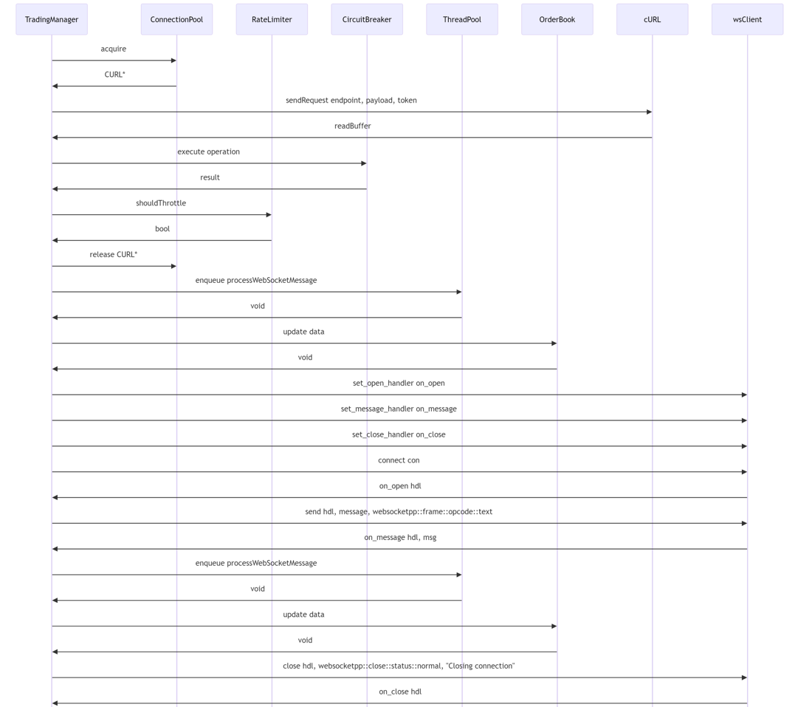

# Documentation of Trading Manager System

# Overview

The Trading Manager is a comprehensive trading system that provides functionalities for order management, market data processing, and WebSocket communication. The system is designed to interact with a cryptocurrency exchange API to perform trading operations such as order placement, modification, and cancellation, as well as real-time market data processing.

## Components of the Trading System

1.  **ConnectionPool:** Manages a pool of CURL connections to optimize network requests.
2.  **OrderBook:** Processes and maintains the order book data.
3.  **RateLimiter:** Implements a rate-limiting mechanism to prevent excessive requests.
4.  **CircuitBreaker:** Provides a circuit breaker pattern to handle failures and prevent cascading issues.
5.  **TradingManager:** The main class that handles the trading logic, including WebSocket communication, order management, and position retrieval.
6.  **TradingManager::ThreadPool:** A thread pool used to handle asynchronous processing of WebSocket messages.



### ConnectionPool

*   **AcquireConnection:** Acquires a connection from the pool by locking the mutex, checking if connections are available, popping a connection from the pool, and releasing the mutex. If no connections are available, it returns a `nullptr`.
*   **ReleaseConnection:** Releases a connection back to the pool by locking the mutex, checking if the pool size is less than the maximum, pushing the connection back to the pool, and releasing the mutex. If the pool is full, it cleans up the connection.
*   **SetupCurlOptions:** Sets various timeout, connection, and encoding options for the cURL connections.

### RateLimiter

*   **ShouldThrottle:** Checks if the rate limiter should throttle the request by locking the mutex, getting the current time, removing expired request times from the queue, checking if the request count exceeds the limit, adding the current time to the queue, and releasing the mutex. It returns `true` if throttling is required, `false` otherwise.

### CircuitBreaker

*   **Execute:** Executes the provided operation using the circuit breaker. It checks if the circuit breaker is open, checks if the reset timeout has elapsed, resets the circuit breaker if the timeout has elapsed, tries to execute the operation, increments the failure count on failure, checks if the failure count exceeds the threshold, and opens the circuit breaker if the threshold is reached.

### ThreadPool

*   **Enqueue:** Enqueues a task to the thread pool by locking the queue mutex, adding the task to the queue, notifying a worker thread, and releasing the mutex.
*   **WorkerThread:** Represents a worker thread that waits for tasks, gets the next task from the queue, and executes the task.

### TradingManager

*   **send_request:** Sends a request using the connection pool, rate limiter, and circuit breaker. It checks if the rate limiter should throttle the request, executes the request using the circuit breaker, acquires a connection from the pool, sets the request URL, method, and payload, sets the request headers, sets the write callback function, performs the cURL request, checks the response code, releases the connection back to the pool, and returns the response string. It also handles any exceptions and releases the connection.
*   **ws_message:** Handles a WebSocket message by parsing the message payload into a JSON object, checking if the message contains params and data, and enqueuing the message processing task to the thread pool. It also measures the message processing latency.
*   **ProcessWebSocketMessage:** Processes a WebSocket message by incrementing the update counter, printing the update counter, checking if the response contains params and data, printing the received data structure, and processing the order book data.
*   **ProcessOrderBookData:** Updates the order book with the received data.
*   **ConnectWebSocket:** Connects to the WebSocket by stopping and joining the previous connection if any, resetting and reinitializing the WebSocket client, setting the event handlers, and creating the WebSocket connection and starting the client in a new thread.
*   **SendWebSocketMessage:** Sends a message through the WebSocket connection by checking if the connection is established, sending the message, and handling the case when the connection is not established.
*   **subOrderBook:** Subscribes to the order book by adding the instrument to the subscribed instruments set, constructing the subscription payload, sending the subscription message through the WebSocket, and starting a new thread to close the connection after the specified duration.


# Code Documentation 

## Optimization Classes

### ConnectionPool
- **Purpose**: Manages a pool of reusable connections to trading venues, optimizing network operations and reducing the overhead of creating/destroying connections.
  
#### `ConnectionPool::ConnectionPool()`
- **Constructor**: Initializes a pool of `CURL` connections with predefined size and configurations.
  - **Parameters**:
    - `max_size` *(default: 10)*: Maximum number of connections in the pool.
  - **Operations**:
    - Allocates and initializes `CURL` handles.
    - Configures each handle with optimized options for connection timeout, keep-alive, and compression.

#### `ConnectionPool::~ConnectionPool()`
- **Destructor**: Cleans up all `CURL` connections in the pool to avoid memory leaks.

#### **Methods**:
- `setupCurlOptions(CURL* curl)`:
  - Configures common options for `CURL` handles, such as timeouts and compression settings.

- `CURL* acquire()`:
  - Retrieves a connection from the pool. Returns `nullptr` if the pool is empty.

- `void release(CURL* conn)`:
  - Returns a connection to the pool or cleans it up if the pool is full.

---

### OrderBook
- **Purpose**: Maintains and updates the bid and ask prices for an asset, providing a real-time view of the order book.

#### **Methods**:
- `void update(const json& data)`:
  - Updates the order book state based on incoming data (`snapshot` or `change`).
  - **Parameters**:
    - `data`: JSON object containing bid/ask updates or a full snapshot.
  - Handles additions, updates, and deletions of bids and asks.

- `std::vector<double> getBidPrices() / getBidVolumes() / getAskPrices() / getAskVolumes()`:
  - Returns vectors of bid/ask prices or volumes for analysis, potentially for SIMD optimization.

#### **Key Features**:
- Supports efficient updates and snapshot handling.
- Prints a summary of the top bids and asks for debugging or analysis purposes.

---

### RateLimiter
- **Purpose**: Controls the rate of requests sent to trading venues, preventing exceeding API rate limits.

#### `RateLimiter(size_t max_req, std::chrono::seconds win)`:
- **Constructor**: Initializes the rate limiter with maximum allowed requests and time window.
  - **Parameters**:
    - `max_req`: Maximum number of requests allowed within the specified window.
    - `win`: Time window for rate limiting.

#### **Methods**:
- `bool shouldThrottle()`:
  - Determines if the current request should be throttled.
  - Returns `true` if the request exceeds the rate limit.

#### **Key Features**:
- Automatically purges outdated request timestamps.
- Thread-safe implementation using a mutex.

---

### CircuitBreaker
- **Purpose**: Monitors the success and failure of operations, preventing cascading failures by temporarily disabling operations after repeated failures.

#### **Template Method**:
- `template<typename Func> auto execute(Func operation)`:
  - Executes the provided operation if the circuit breaker is closed.
  - If failures exceed the threshold, opens the circuit breaker and prevents further execution.

#### **Key Features**:
- Failure threshold: 5 consecutive failures.
- Reset timeout: 30 seconds after the last failure.
- Automatically resets after the timeout if no further failures occur.

---


### ThreadPool
- **Purpose**: Provides a mechanism to manage and execute tasks concurrently across multiple threads, optimizing CPU utilization and enabling efficient handling of asynchronous operations.

#### `ThreadPool::ThreadPool(size_t threads)`
- **Constructor**: Initializes the thread pool with a specified number of worker threads.
  - **Parameters**:
    - `threads`: Number of worker threads to create.
  - **Operations**:
    - Spawns the specified number of threads.
    - Each thread waits for tasks to be added to the task queue and executes them sequentially.

#### `~ThreadPool()`
- **Destructor**: Gracefully shuts down the thread pool.
  - Signals all threads to stop.
  - Waits for all worker threads to complete execution before destroying the thread pool.

#### **Methods**:
- **template<class F> void enqueue(F&& f)**:
  - Adds a new task to the task queue for execution by the worker threads.
  - **Parameters**:
    - `f`: A callable object (e.g., a lambda or function) representing the task to execute.
  - **Thread Safety**:
    - Uses a mutex to ensure safe access to the task queue.
    - Notifies one worker thread to pick up the new task.

---

#### **Key Features**:
1. **Dynamic Task Execution**:
   - Tasks are enqueued dynamically and processed by the next available thread.
   - Supports a wide range of callable types using templates.

2. **Thread Safety**:
   - Protects the task queue using a mutex.
   - Prevents data races when multiple threads interact with the shared queue.

3. **Graceful Shutdown**:
   - Ensures all tasks in the queue are completed before shutting down the thread pool.
   - Uses a condition variable to signal worker threads when tasks are available or when the thread pool is stopping.

4. **Efficient Resource Utilization**:
   - Enables concurrent execution of tasks, making full use of available CPU cores.
   - Reduces the overhead of frequent thread creation and destruction for each task.

---

## TradingManager : Helper Functions

The **TradingManager** class is a high-level component designed for managing trading operations. It facilitates secure communication with a trading platform's REST and WebSocket APIs, manages order book updates, and handles concurrency through robust threading and optimization mechanisms.

---

### **Constructors and Destructors**

1. **Constructor**:
   - **Signature**: `TradingManager(const std::string &id, const std::string &secretId)`
   - **Parameters**:
     - `id`: Client ID for authentication.
     - `secretId`: Client secret for authentication.
   - **Features**:
     - Initializes `clientId` and `clientSecretId`.
     - Sets up a thread pool with a size equal to the hardware concurrency.
     - Configures:
       - `ConnectionPool` (with a pool size of 10).
       - `RateLimiter` (100 requests per second).
       - `CircuitBreaker`.
     - Configures WebSocket client (`wsClient`) with appropriate handlers for open, message, and close events.

2. **Destructor**:
   - **Signature**: `~TradingManager()`
   - **Features**:
     - Stops the WebSocket client if running and joins the thread.
     - Closes WebSocket connection if connected.

---

### **Class Overview**
#### **Private Member Variables**
1. **Authentication Details**:
   - `clientId` & `clientSecretId`: Used for authenticating API requests.
   - `accessToken`: Token for secure communication with the API.

2. **API Endpoints**:
   - `baseUrl`: REST API base URL.
   - `wsUrl`: WebSocket API URL.

3. **WebSocket Management**:
   - `wsClient`: Manages WebSocket communication.
   - `hdl`: WebSocket connection handle.
   - `wsThread`: Dedicated thread for WebSocket operations.

4. **Concurrency & State Management**:
   - `isConnected` & `shouldStop`: Atomic flags for connection state.
   - `update_counter`: Atomic counter for tracking updates.
   - `threadPool`: A thread pool for offloading computationally intensive tasks.

5. **Utilities**:
   - `connPool`: Connection pool for managing CURL connections.
   - `rateLimiter`: Enforces request rate limits.
   - `circuitBreaker`: Prevents excessive retries during API failures.
   - `orderBook`: Maintains and updates the order book.

---

### **Core Methods**

#### `send_request`
- Sends a REST API request to the specified endpoint.
- **Parameters**:
  - `endpoint`: API endpoint relative to `baseUrl`.
  - `payload`: JSON payload for the request.
  - `token` (optional): Authorization token.
- **Features**:
  - Rate-limiting with `RateLimiter`.
  - Circuit-breaker protection using `CircuitBreaker`.
  - Connection pooling via `ConnectionPool`.
  - Error handling for CURL operations.

#### `on_message`
- Handles incoming WebSocket messages.
- **Parameters**:
  - `hdl`: WebSocket connection handle.
  - `msg`: Message received from the WebSocket.
- **Features**:
  - Parses JSON messages efficiently.
  - Offloads processing to `ThreadPool` for scalability.
  - Measures and logs processing latency.

#### `processWebSocketMessage`
- Processes WebSocket messages containing order book data.
- **Parameters**:
  - `response`: JSON message parsed from WebSocket.
- **Features**:
  - Updates `update_counter` for tracking.
  - Processes and debugs received order book data.
  - Catches and logs processing errors.

#### `processOrderBookData`
- Updates the order book with new data.
- **Parameters**:
  - `data`: JSON structure containing order book updates.
- **Features**:
  - Validates and applies updates to `OrderBook`.
  - Handles any exceptions during updates.

#### **debugPrint**
- Prints JSON structures with a debug prefix.
- **Parameters**:
  - `j`: JSON object to print.
  - `prefix`: Optional prefix for the debug message.

---

### **Core Functionality**

#### **WebSocket Management**

1. `connectWebSocket`:
   - **Purpose**: Establishes a WebSocket connection.
   - **Steps**:
     - Stops and cleans up any existing connection.
     - Reinitializes the WebSocket client (`wsClient`) and sets handlers.
     - Configures TLS for secure connections.
     - Creates and connects a WebSocket session.
     - Runs the WebSocket client in a separate thread.

2. `sendWebSocketMessage`:
   - **Purpose**: Sends a message over the WebSocket connection.
   - **Parameters**:
     - `message`: The message payload to send.
   - **Features**:
     - Ensures the WebSocket is connected before sending.
     - Logs an error if the WebSocket is not connected.

3. `ws_onOpen`:
   - **Purpose**: Handler triggered when the WebSocket connection is established.
   - **Parameters**:
     - `hdl`: WebSocket connection handle.
   - **Features**:
     - Sets the connection handle (`hdl`).
     - Marks the WebSocket as connected.

4. `ws_onClose`:
   - **Purpose**: Handler triggered when the WebSocket connection is closed.
   - **Parameters**:
     - `hdl`: WebSocket connection handle.
   - **Features**:
     - Marks the WebSocket as disconnected.

---

#### **Subscription Management**

1. `subOrderBook`:
   - **Purpose**: Subscribes to an order book for a specified instrument.
   - **Parameters**:
     - `instrument`: The instrument to subscribe to.
     - `duration_seconds`: Duration to maintain the subscription.
   - **Features**:
     - Sends a subscription request over WebSocket.
     - Starts a detached thread to close the connection after the specified duration.

2. `showSubscriptions`:
   - **Purpose**: Displays all current subscriptions.
   - **Features**:
     - Iterates through and prints all subscribed instruments.

---

#### **Authentication**

1. `authenticate`:
   - **Purpose**: Authenticates with the API and retrieves an access token.
   - **Steps**:
     - Sends a request with `clientId` and `clientSecretId` for authentication.
     - Parses the response to extract the `access_token`.
     - Logs success or failure with error details if authentication fails.

2. `getAccessToken`:
   - **Purpose**: Retrieves the stored access token.
   - **Return Type**: `const std::string&`
---

### Core Features

This trading client is designed for robust, high-performance interaction with the Deribit exchange. Key features include:

*   **Optimized API Interactions:** Combines rate limiting, connection pooling, and circuit breaking to ensure efficient and fault-tolerant REST API calls. This approach minimizes latency, maximizes throughput, and prevents cascading failures.
*   **Scalable WebSocket Processing:** Employs a thread pool for asynchronous handling of high-volume WebSocket messages. This ensures low latency, prevents blocking of the main thread, and maintains responsiveness.
*   **Real-Time Order Book Management:** Efficiently updates and maintains a local order book representation based on real-time market data received via WebSockets. This provides up-to-the-second market information.
*   **Secure Communication:** Implements secure WebSocket connections with TLS encryption and robust error handling to protect sensitive data and ensure connection stability.
*   **Robust Error Handling:** Provides comprehensive exception handling across all operations, including API requests, WebSocket communication, and order book updates, ensuring application stability and informative error reporting.
*   **Automated Subscription Management:** Streamlines the subscription and disconnection process for market data streams with clear logging for monitoring and debugging.
*   **Secure Authentication:** Implements a secure authentication mechanism to obtain access tokens for authorized API access, with detailed error handling for authentication failures.
*   **Thread Safety:** Utilizes atomic variables and appropriate locking mechanisms to guarantee thread safety and prevent race conditions in concurrent operations.

---


## TradingManager : Wrapper Functions

### `putOrder`

#### Description:
Places a limit order for a specified instrument with a given price and amount.

#### Parameters:
- `instrument` (const std::string&): The name of the instrument to trade.
- `accessToken` (const std::string&): The access token for authentication.
- `price` (double): The price at which to place the order.
- `amount` (double): The quantity of the instrument to trade.

#### Behavior:
- Constructs a JSON payload for the order request.
- Sends the request using `send_request` and measures latency.
- Parses the response to check for errors or success.

#### Output:
- Logs success or error details with latency for placing the order.

---

### `allOpenOrders`

#### Description:
Retrieves a list of all open orders.

#### Parameters:
None.

#### Behavior:
- Sends a request to fetch open orders.
- Parses the response and logs detailed information about each order, including:
  - Order ID
  - Instrument name
  - Price
  - Quantity

#### Output:
- Prints the details of all open orders or logs if no orders are found.

---

### `removeOrder`

#### Description:
Cancels an order using its ID.

#### Parameters:
- `accesstoken` (const std::string&): The access token for authentication.
- `orderId` (const std::string&): The ID of the order to cancel.

#### Behavior:
- Constructs a JSON payload for the cancel request.
- Sends the request and measures latency.
- Logs success or error details.

#### Output:
- Logs the success or failure of the cancellation operation along with latency.

---

### `modifyOrder`

#### Description:
Modifies an existing order by updating its price and amount.

#### Parameters:
- `accesstoken` (const std::string&): The access token for authentication.
- `orderId` (const std::string&): The ID of the order to modify.
- `newPrice` (double): The new price for the order.
- `newAmount` (double): The new quantity for the order.

#### Behavior:
- Constructs a JSON payload for the modification request.
- Sends the request and measures latency.
- Parses the response for success or error details.

#### Output:
- Logs success or failure messages, including latency.

---

### `getOrderBook`

#### Description:
Fetches the order book for a specific instrument up to a specified depth.

#### Parameters:
- `instrument` (const std::string&): The name of the instrument.
- `depth` (int): The depth of the order book to retrieve.

#### Behavior:
- Sends a request to fetch the order book.
- Parses and logs bid and ask details, along with general metadata.
- Measures and logs the latency.

#### Output:
- Prints detailed order book information or logs errors.

---

### `fetchPositions`

#### Description:
Retrieves the positions for a specified currency and kind.

#### Parameters:
- `accessToken` (const std::string&): The access token for authentication.
- `currency` (const std::string&): The currency to query.
- `kind` (const std::string&): The type of position (e.g., "option", "future").

#### Behavior:
- Sends a request to fetch positions and measures latency.
- Parses the response to log position details or error messages.

#### Output:
- Prints the position details or logs error messages.

---

# Optimization

##  Memory Management Optimizations:

### Smart Pointer Usage:

```cpp
std::unique_ptr<client> wsClient = std::make_unique<client>();
std::unique_ptr<std::thread> wsThread = std::make_unique<std::thread>();
```

*   Smart pointers ensure automatic memory cleanup and prevent memory leaks
*   RAII principle is followed for resource management
*   Eliminates need for manual deletion in destructor

### Static Thread-Local Storage:

```cpp
static thread_local json parser;
static thread_local std::string buffer;
```

*   Thread-local storage prevents memory contention
*   Each thread gets its own parser instance
*   Reduces memory allocation/deallocation overhead

### Connection Pool Implementation:

```cpp
class ConnectionPool {
private:
    std::vector<CURL*> connections;
    std::mutex pool_mutex;
    size_t max_connections;
    //...
}
```

*   Reuses CURL connections instead of creating new ones
*   Prevents memory fragmentation
*   Reduces allocation/deallocation overhead

## Network Communication Optimizations:

### Connection Pooling:

*   Maintains a pool of pre-initialized CURL connections
*   Reduces connection establishment overhead
*   Implements connection reuse strategy

### Rate Limiting:

```cpp
class RateLimiter {
    std::deque<std::chrono::steady_clock::time_point> request_times;
    const size_t max_requests;
    const std::chrono::seconds window;
    //...
}
```

*   Prevents server overload
*   Implements sliding window rate limiting
*   Ensures optimal API usage

### Circuit Breaker Pattern:

```cpp
class CircuitBreaker {
    std::atomic<int> failure_count{0};
    std::atomic<bool> is_open{false};
    //...
}
```

*   Prevents cascade failures
*   Implements automatic service recovery
*   Reduces network load during failures

##  Data Structure Selection:

### Order Book Implementation:

```cpp
class OrderBook {
    std::map<double, double> bids;  // price -> volume
    std::map<double, double> asks;  // price -> volume
    //...
}
```

*   Uses ordered maps for efficient price-level management
*   Automatic sorting of price levels
*   O(log n) complexity for updates and queries

### Subscription Management:

```cpp
std::unordered_set<std::string> subscribed_instruments;
```

*   O(1) lookup time for subscriptions
*   Memory efficient for string storage
*   Fast insertion and deletion

### Request Queue Management:

```cpp
std::queue<std::function<void()>> tasks;
```

*   FIFO processing of tasks
*   Efficient memory usage for task storage
*   Thread-safe implementation

## Thread Management Optimizations:

### Thread Pool Implementation:

```cpp
class ThreadPool {
    std::vector<std::thread> workers;
    std::queue<std::function<void()>> tasks;
    std::condition_variable condition;
    //...
}
```

*   Dynamic task distribution across worker threads
*   Prevents thread creation/destruction overhead
*   Uses hardware concurrency for optimal thread count

```cpp
ThreadPool(size_t threads) : stop(false) {
    for(size_t i = 0; i < threads; ++i) {
        workers.emplace_back([this] { /* worker function */ });
    }
}
```

### Thread Synchronization:

```cpp
std::mutex pool_mutex;
std::condition_variable condition;
std::atomic<bool> isConnected{false};
std::atomic<bool> shouldStop{false};
```

*   Uses atomic variables for flag management
*   Condition variables for thread coordination
*   Fine-grained mutex locking

### WebSocket Thread Management:

```cpp
std::unique_ptr<std::thread> wsThread = std::make_unique<std::thread>();
```

*   Dedicated thread for WebSocket operations
*   Clean thread lifecycle management
*   Proper shutdown handling

##  CPU Optimization:

### SIMD Support:

```cpp
#include <immintrin.h>
// Vector getters for SIMD processing
std::vector<double> getBidPrices() const;
std::vector<double> getBidVolumes() const;
```

*   Prepared for SIMD operations on price/volume data
*   Vectorized data structure access
*   Potential for parallel processing

### Lock-Free Operations:

```cpp
static std::atomic<int> update_counter;
std::atomic<bool> isConnected{false};
```

*   Minimizes thread contention
*   Reduces CPU cache invalidation
*   Improves parallel performance

### Memory Layout Optimization:

```cpp
class OrderBook {
    std::map<double, double> bids;
    std::map<double, double> asks;
}
```

*   Cache-friendly data structures
*   Contiguous memory allocation where possible
*   Efficient data access patterns

## Bottlenecks Identified:

###  Memory-Related:

*   Potential memory fragmentation in connection pool
*   Possible excessive copying in WebSocket message handling
*   Large order book data structure memory footprint

### Network-Related:

*   Synchronous network operations in some parts
*   Fixed connection pool size might be suboptimal
*   WebSocket reconnection handling could be improved

###  Processing-Related:

*   Limited use of SIMD capabilities
*   Potential lock contention in thread pool
*   JSON parsing overhead in message handling

###  Threading-Related:

*   Fixed thread pool size might not be optimal
*   Possible thread starvation under high load
*   Lock contention in connection pool

## Potential Improvements:

###  Memory Optimizations:

*   Implement memory pooling for frequently allocated objects
*   Use stack-based allocation for small objects
*   Add custom allocators for containers

```cpp
template<typename T>
using PoolAllocator = /* custom allocator implementation */;
std::vector<double, PoolAllocator<double>> prices;
```

###  Network Improvements:

*   Implement connection pooling with dynamic sizing
*   Add connection keep-alive management
*   Implement request batching

```cpp
class DynamicConnectionPool {
    std::vector<CURL*> connections;
    size_t min_connections;
    size_t max_connections;
    // Dynamic scaling logic
};
```

###  Threading Enhancements:

*   Implement work-stealing thread pool
*   Add priority queue for tasks
*   Improve thread affinity management

```cpp
class WorkStealingThreadPool {
    struct Worker {
        std::deque<Task> local_queue;
        std::mutex queue_mutex;
    };
    std::vector<Worker> workers;
};
```

###  Performance Monitoring:

*   Add performance metrics collection
*   Implement adaptive thread scaling
*   Add latency monitoring

```cpp
class PerformanceMonitor {
    std::atomic<uint64_t> message_count{0};
    std::atomic<uint64_t> total_latency{0};
    std::atomic<uint64_t> max_latency{0};
};
```

###  CPU Optimization:

*   Implement full SIMD processing for order book updates
*   Add vectorized price level matching
*   Optimize memory alignment for SIMD operations

```cpp
alignas(32) struct PriceLevelSIMD {
    __m256d prices;
    __m256d volumes;
};
```

These improvements would significantly enhance the performance and reliability of the trading system while maintaining its current functionality.

---

# Trading System Latency Benchmark Tool

## Introduction
The benchmark.cpp implementation represents a comprehensive latency measurement tool designed for trading system. Its primary purpose is to evaluate and analyze the performance of various trading operations by measuring their execution latencies. The tool interfaces with a TradingManager program to conduct performance measurements across different trading operations including order placement, modification, cancellation, and market data processing.

## Purpose and Objectives
The main objectives of this benchmarking tool are:
- Measure and analyze latencies for critical trading operations
- Generate detailed performance metrics for system evaluation

## System Overview
The benchmark tool is designed to interact with a TradingManager application and measures five key types of latencies:
- Order placement latency
- Order modification latency
- Order cancellation latency
- Orderbook retrieval latency
- WebSocket message processing latency (market data updates)

## Core Components Analysis

### Utility Functions
- `getRandomInRange(int min, int max)`: Generates random numbers within specified bounds
- `getRandomText()`: Selects random trading instruments from a predefined list
- `executeCommand(const std::string& cmd)`: Executes shell commands and captures output
- `calculateLatencyAverage(const std::string& filename, int n)`: Processes CSV files to compute average latencies

### Order Management Functions

#### Order Placement
`Calculate_Order_Latency(int n, int delay, std::string filename)`
- Purpose: Measures latency for placing new orders
- Process:
  - Places n orders with specified parameters
  - Records latencies in CSV format
  - Calculates average placement latency
  - Supports configurable delays between operations

#### Order Modification
`Calculate_Modification_Latency(int delay, std::string filename)`
- Purpose: Measures order modification performance
- Features:
  - Modifies existing orders with new prices and amounts
  - Tracks modification latencies
  - Uses predefined constants NEW_PRICE and NEW_AMOUNT

#### Order Cancellation
`Calculate_Cancellation_Latency(int delay, std::string filename)`
- Purpose: Evaluates order cancellation performance
- Implementation:
  - Processes cancellations for existing orders
  - Records cancellation latencies
  - Supports configurable delays between operations

### Market Data Functions

#### Orderbook Processing
`Calculate_OrderBook_Latency(int numIterations, int delay, std::string filename)`
- Purpose: Measures orderbook retrieval performance
- Features:
  - Retrieves orderbook data with varying depths
  - Records retrieval latencies
  - Supports multiple iterations for statistical significance

#### WebSocket Processing
`Calculate_Web_Socket_Latency(int numIterations, int delay, std::string filename)`
- Purpose: Measures market data subscription and processing performance
- Implementation:
  - Subscribes to market data feeds
  - Measures message processing latencies in microseconds
  - Supports multiple subscription iterations

## Data Management

### File Operations
The system implements comprehensive file handling for:
- CSV generation for latency measurements
- Order ID management through text files
- Structured data output for analysis

### Data Formats
- Order placement data: Instrument, Price, Amount, Latency
- Modification data: OrderID, NewPrice, NewAmount, Latency
- Cancellation data: OrderID, CancellationLatency
- Orderbook data: Instrument, Depth, Latency
- WebSocket data: Timestamp, Instrument, UpdateNumber, Latency

## Implementation Details

### Error Handling
The implementation includes robust error handling for:
- File operations
- Command execution
- Data parsing
- Numeric conversions

### Performance Considerations
- Implements delays between operations to prevent system overload
- Uses efficient string processing for output parsing
- Provides configurable iteration counts for statistical significance
- Implements buffer management for command output capture

## Usage Interface
The tool provides a menu-driven interface with options for:
1. Order placement latency measurement
2. Orderbook latency measurement
3. Order modification latency measurement
4. Order cancellation latency measurement
5. WebSocket latency measurement
6. Order ID retrieval
7. Comprehensive benchmark suite execution

## Output and Reporting
The system generates:
- Detailed CSV files for each operation type
- Average latency calculations
- Comprehensive summary statistics
- Real-time progress reporting
- Aggregate performance metrics

## Results

Optimization was done on this tool to improve the performance of the trading system. The following table shows the latency values before and after optimization:

| Latency Type                | Before Optimization | After Optimization |
|-----------------------------|---------------------|---------------------|
| Orders Placed               | 502.89 ms           | 165.83 ms           |
| Orderbook / Market Data     | 506.03 ms           | 163.47 ms           |
| Modification                | 504.455 ms          | 166.886 ms          |
| Cancellation                | 493.326 ms          | 166.057 ms          |
| Web Socket Propagation Delay| 3744.423 µs (3.74 ms)| 2299.02 µs (2.3 ms) |
| Positions Latency           | 504.455 ms          | 144.32 ms        |
| Trading Loop Latency        | 501.86 ms           | 132.908 ms          |

The optimization has significantly reduced the latencies for all operations, leading to improved system performance and responsiveness.
