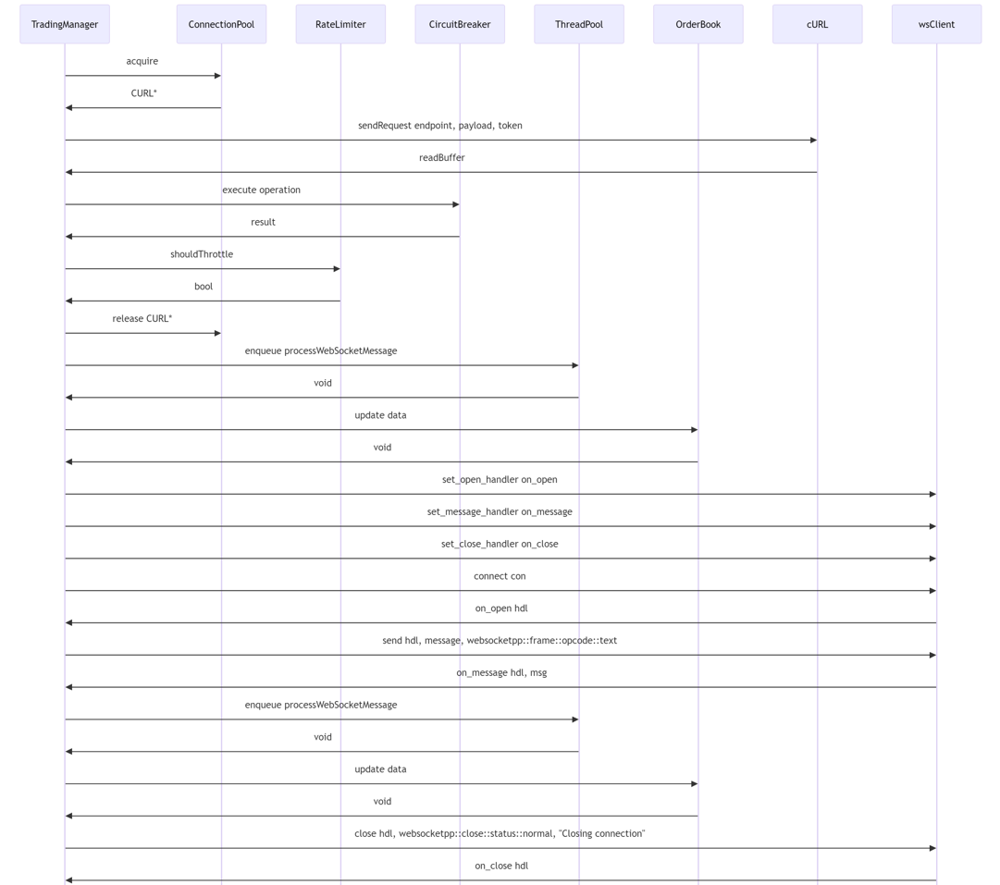

# Overview

The Trading Manager is a comprehensive trading system that provides functionalities for order management, market data processing, and WebSocket communication. The system is designed to interact with a cryptocurrency exchange API to perform trading operations such as order placement, modification, and cancellation, as well as real-time market data processing.

## Components of the Trading System

1.  **ConnectionPool:** Manages a pool of CURL connections to optimize network requests.
2.  **OrderBook:** Processes and maintains the order book data.
3.  **RateLimiter:** Implements a rate-limiting mechanism to prevent excessive requests.
4.  **CircuitBreaker:** Provides a circuit breaker pattern to handle failures and prevent cascading issues.
5.  **TradingManager:** The main class that handles the trading logic, including WebSocket communication, order management, and position retrieval.
6.  **TradingManager::ThreadPool:** A thread pool used to handle asynchronous processing of WebSocket messages.

### ConnectionPool

*   **AcquireConnection:** Acquires a connection from the pool by locking the mutex, checking if connections are available, popping a connection from the pool, and releasing the mutex. If no connections are available, it returns a `nullptr`.
*   **ReleaseConnection:** Releases a connection back to the pool by locking the mutex, checking if the pool size is less than the maximum, pushing the connection back to the pool, and releasing the mutex. If the pool is full, it cleans up the connection.
*   **SetupCurlOptions:** Sets various timeout, connection, and encoding options for the cURL connections.

### RateLimiter

*   **ShouldThrottle:** Checks if the rate limiter should throttle the request by locking the mutex, getting the current time, removing expired request times from the queue, checking if the request count exceeds the limit, adding the current time to the queue, and releasing the mutex. It returns `true` if throttling is required, `false` otherwise.

### CircuitBreaker

*   **Execute:** Executes the provided operation using the circuit breaker. It checks if the circuit breaker is open, checks if the reset timeout has elapsed, resets the circuit breaker if the timeout has elapsed, tries to execute the operation, increments the failure count on failure, checks if the failure count exceeds the threshold, and opens the circuit breaker if the threshold is reached.

### ThreadPool

*   **Enqueue:** Enqueues a task to the thread pool by locking the queue mutex, adding the task to the queue, notifying a worker thread, and releasing the mutex.
*   **WorkerThread:** Represents a worker thread that waits for tasks, gets the next task from the queue, and executes the task.

### TradingManager

*   **SendRequest:** Sends a request using the connection pool, rate limiter, and circuit breaker. It checks if the rate limiter should throttle the request, executes the request using the circuit breaker, acquires a connection from the pool, sets the request URL, method, and payload, sets the request headers, sets the write callback function, performs the cURL request, checks the response code, releases the connection back to the pool, and returns the response string. It also handles any exceptions and releases the connection.
*   **OnMessage:** Handles a WebSocket message by parsing the message payload into a JSON object, checking if the message contains params and data, and enqueuing the message processing task to the thread pool. It also measures the message processing latency.
*   **ProcessWebSocketMessage:** Processes a WebSocket message by incrementing the update counter, printing the update counter, checking if the response contains params and data, printing the received data structure, and processing the order book data.
*   **ProcessOrderBookData:** Updates the order book with the received data.
*   **ConnectWebSocket:** Connects to the WebSocket by stopping and joining the previous connection if any, resetting and reinitializing the WebSocket client, setting the event handlers, and creating the WebSocket connection and starting the client in a new thread.
*   **SendWebSocketMessage:** Sends a message through the WebSocket connection by checking if the connection is established, sending the message, and handling the case when the connection is not established.
*   **SubscribeToOrderBook:** Subscribes to the order book by adding the instrument to the subscribed instruments set, constructing the subscription payload, sending the subscription message through the WebSocket, and starting a new thread to close the connection after the specified duration.

